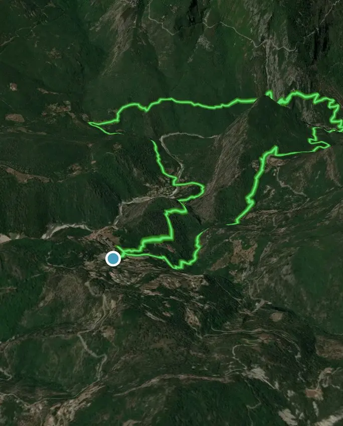

## 🥾 Gilette - Fougassières - La Clave

Cette randonnée entre Gilette, les Fougassières et la Clave offre une belle immersion dans l’arrière-pays niçois. L’itinéraire alterne pistes forestières, sentiers en balcon et passages plus sauvages, avec de superbes panoramas sur les vallées environnantes. Entre villages perchés, restanques et paysages méditerranéens, cette boucle constitue une sortie agréable pour découvrir un patrimoine rural préservé dans une ambiance calme et authentique.

<!--more-->

